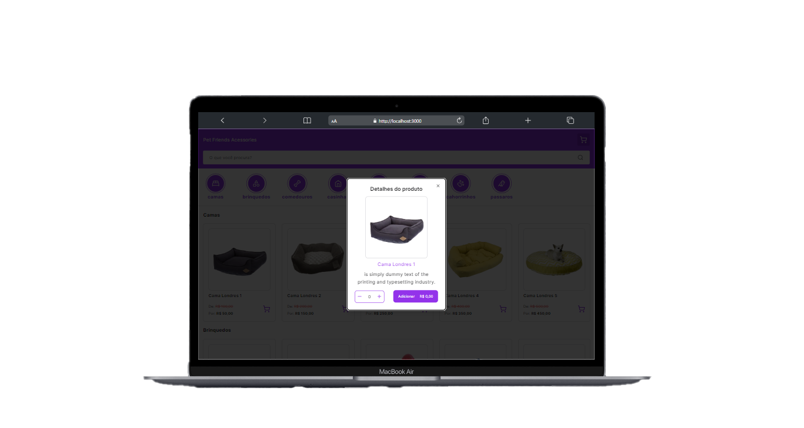

<h1 align="center">Loja Virtual</h1>

## 1 - Sobre

Este repositório contém o código-fonte para a interface de consumidores da Lojinha Virtual, um projeto desenvolvido como parte de um teste técnico. A interface permite aos usuários visualizar os produtos disponíveis, agrupados por categoria, pesquisar por produtos específicos e adicionar itens ao carrinho de compras.

## 2 - Tecnologias

Um pouco das tecnologias que foram utilizadas no projeto:

- NextJS
- TypeScript
- Tailwind CSS
- Radix/UI
- JSON-Server

## 3 - Instruções de Uso:

Você precisa ter o [Node](https://nodejs.org/en/), o [Git](https://git-scm.com/) e algum gerenciador de pacotes([NPM](https://docs.npmjs.com/downloading-and-installing-node-js-and-npm/) | [Yarn](https://classic.yarnpkg.com/lang/en/docs/install)) instalados em sua máquina.

### Preparando o ambiente

```bash
1. Clone o repositório:
$ git clone https://github.com/felipems1/teste-tecnico-03.git

2. Acesse a pasta e instale as dependências via terminal:
$ yarn install / npm install
```

### Rodando a aplicação

```bash
1. Inicie o JSON-Server:
$ yarn dev:server / npm run dev:server

2. Inicie a aplicação em modo de desenvolvimento:
$ yarn dev / npm run dev

3. O servidor será aberto em http://localhost:3000
```

## 4 - Desktop
<div align="center">
  
  
</div>

## 5 - Mobile
<div align="center">
  
  
</div>

---

<p align="center">Projeto feito com ❤️ por <a href="https://www.linkedin.com/in/felipems1/">Felipe Moises</a></p>
